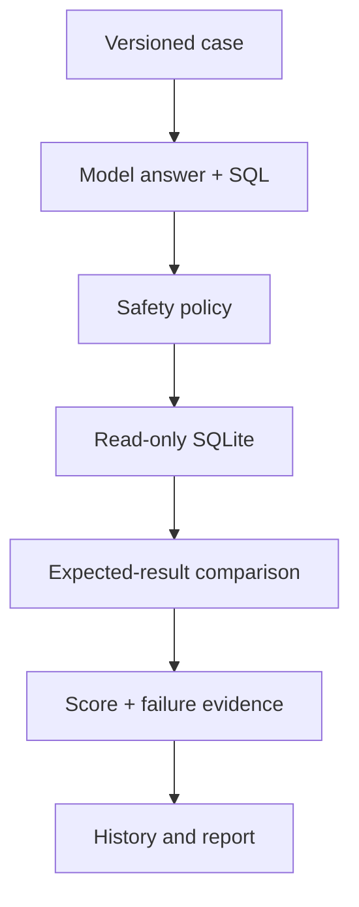

# KERF

**Evidence-first evaluation infrastructure for AI agents that answer questions from business data.**

KERF runs versioned business questions against an AI model, executes the generated SQL through a locked-down read-only layer, compares the returned rows with deterministic expected results, and records failures, latency, tokens, cost, and model version.

> Status: pre-launch MVP. The included business, customers, transactions, and results are synthetic. No beta users or live-model claims are fabricated.

## What works now

- FastAPI backend and interactive dashboard.
- OpenAI Responses API adapter with strict structured output.
- Manual GitHub Actions workflow for an auditable two-profile live comparison.
- Deterministic fixture provider for zero-cost development and CI.
- Twenty versioned evaluation cases across revenue, customers, sales, finance, and operations.
- Synthetic SQLite business database with customers, bookings, payments, services, technicians, and leads.
- Read-only SQL enforcement through lexical checks, SQLite read-only mode, an authorizer allowlist, a progress limit, and a row limit.
- Automated result and answer-fact scoring.
- Persistent run history and two-to-five-run model comparisons.
- Per-run reasoning effort plus cached-input, reasoning-token, response-ID, latency, and cost evidence.
- Markdown, CSV, and JSON report downloads.
- Honest evidence tracker for runs, failures, models, cost, latency, beta users, releases, commits, and issues.
- Feedback and issue-capture endpoints for the beta phase.

## Quick start

```bash
python3 -m venv .venv
source .venv/bin/activate
python -m pip install -e '.[dev]'
uvicorn kerf.main:app --reload
```

Open `http://127.0.0.1:8000`.

Run the deterministic suite from the command line:

```bash
kerf run --provider fixture
```

## Run a real model

Create an API key in your own OpenAI account and expose it only through the environment:

```bash
export OPENAI_API_KEY='your-key-from-your-shell-or-secret-manager'
kerf run --provider openai --model gpt-5.6-luna
```

The app uses the OpenAI **Responses API** and strict JSON Schema output. The implementation follows the official [text-generation](https://developers.openai.com/api/docs/guides/text) and [Structured Outputs](https://developers.openai.com/api/docs/guides/structured-outputs) guidance.

The default model is `gpt-5.6-luna`, selected for repeatable, cost-sensitive eval runs. Cost estimates use the official [OpenAI API pricing](https://developers.openai.com/api/docs/pricing) values verified on August 29, 2026. Rates can be overridden through environment variables when pricing changes.

Compare two live profiles locally and export the evidence bundle:

```bash
python scripts/run_live_comparison.py \
  --model-a gpt-5.6-luna --effort-a low \
  --model-b gpt-5.6-terra --effort-b low
```

The comparison command makes 40 paid API requests: 20 cases for each profile. It writes two
run reports and one comparison report in both JSON and Markdown. A benchmark miss is recorded
as evidence; authentication, API, parsing, or execution errors fail the command.

## Run the live milestone in GitHub

1. Open the repository's **Settings → Secrets and variables → Actions** page.
2. Create the repository secret `OPENAI_API_KEY`.
3. Open **Actions → live-eval → Run workflow**.
4. Keep the default Luna-versus-Terra profiles or select different supported model IDs.
5. Download the `kerf-live-comparison` artifact after the run completes.

The live workflow is manual-only so a push or pull request can never create API charges. GitHub
masks the secret and the workflow never prints, stores, or uploads it.

Never paste or commit a real key into `.env.example`, source files, screenshots, issues, or reports.

## How a run works



Each model must return:

```json
{
  "answer": "June revenue was $4,960.",
  "sql": "SELECT ...",
  "explanation": "I summed paid transactions scheduled in June.",
  "confidence": 0.98
}
```

KERF does not accept the prose as proof. It executes the SQL and compares the resulting values with the case's deterministic expected query.

## API surface

| Method | Endpoint | Purpose |
|---|---|---|
| `GET` | `/api/health` | Service and live-key readiness |
| `GET` | `/api/cases` | Twenty versioned eval definitions |
| `POST` | `/api/runs` | Execute a fixture or live-model run |
| `GET` | `/api/runs` | Run history |
| `GET` | `/api/runs/{id}` | Full run evidence |
| `GET` | `/api/compare?run_ids=1,2` | Model-version comparison |
| `GET` | `/api/reports/{id}.md` | Downloadable Markdown report |
| `GET` | `/api/reports/{id}.csv` | Downloadable result table |
| `GET` | `/api/reports/{id}.json` | Machine-readable evidence |
| `GET` | `/api/tracker` | Project evidence metrics |
| `POST` | `/api/feedback` | Record a real beta tester's feedback |
| `POST` | `/api/issues` | Record a reproducible product issue |

Interactive API documentation is available at `/docs` while the server is running.

## Example request

```bash
curl -X POST http://127.0.0.1:8000/api/runs \
  -H 'Content-Type: application/json' \
  -d '{"provider":"fixture","case_ids":["revenue_total","no_show_rate"]}'
```

## SQL safety boundary

Generated SQL is untrusted input. KERF currently applies:

1. One-statement and read-only keyword validation.
2. A SQLite connection opened with `mode=ro` and `immutable=1`.
3. `PRAGMA query_only=ON` and `trusted_schema=OFF`.
4. A SQLite authorizer that denies writes, schema operations, pragmas, transactions, attachments, and non-allowlisted tables.
5. A virtual-machine progress handler and a maximum of 100 returned rows.

This is a meaningful safety layer for the included local demo; it is not a substitute for database isolation, tenant permissions, query timeouts, and security review in a production system.

## Verification

```bash
pytest -q
```

Tests cover the 20-case fixture suite, SQL attack rejection, system-table denial, row limits, API routes, downloads, comparisons, and safe refusal when no live API key exists.

## Honest project metrics

The dashboard reports only recorded activity:

- Evaluation cases created
- Model versions compared
- Runs completed
- Incorrect outputs detected
- Average latency and estimated cost
- Unique beta tester aliases
- Product releases
- Git commits and recorded issues

A fixture run is always labeled as a fixture. It must never be described as an OpenAI model result, a customer result, or beta usage.

## Roadmap

- **Week 1 — complete:** backend, model adapter, 20 cases, fixture validation.
- **Week 2 — complete:** synthetic business database, safe SQL, expected answers, scoring.
- **Week 3 — complete:** run history, comparisons, reports, docs, and public repository.
- **Live milestone — engineering complete, execution pending:** repeatable two-profile workflow;
  requires the repository secret and one manual run before any live-result claim is valid.
- **Week 4 — requires real people:** recruit five testers, capture consented feedback, fix observed failures, and publish an evidence-backed case study.

See [docs/BETA_PLAN.md](docs/BETA_PLAN.md) and [docs/CASE_STUDY_TEMPLATE.md](docs/CASE_STUDY_TEMPLATE.md).

## Professional use

You can accurately describe this as an independent pre-launch software project once you are consistently building and maintaining it. Do not claim customers, revenue, employees, production scale, or beta users until they exist and are documented.

Suggested current role title: **Founder & AI/Data Analyst — KERF (Pre-launch)**.

## License

MIT
